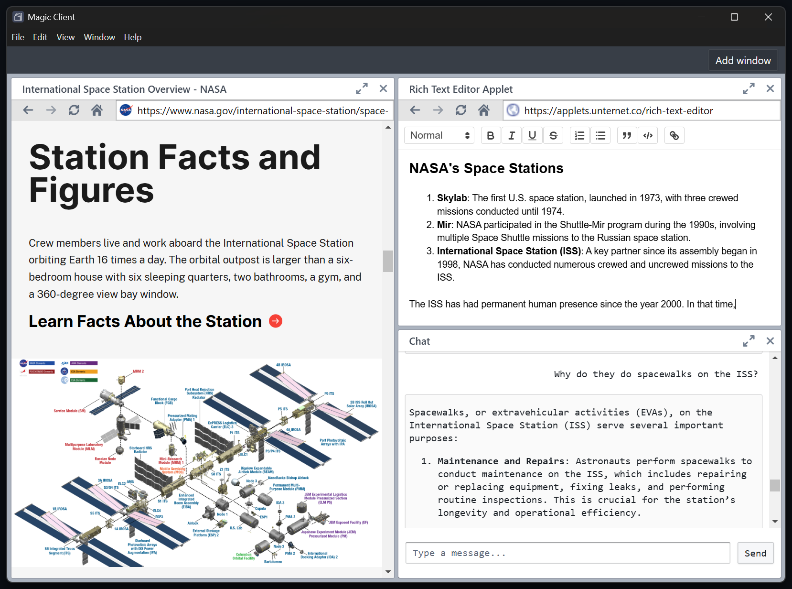

# client-experiment
Experimental web applets client for Capstone project using Electron, React, and the Unternet kernel.

## Setup

For now as this gets developed, do the following

1. Run `npm install`
2. In the kernel folder: Copy `.env.example` to `.env` and fill in the required environment variables
3. Run `npm run build` and `npm run dev`

> [!NOTE]
> The kernel is not yet integrated with the Web Applets SDK. The chat is functional and links opened will open new windows but it cannot yet read any site contents, nor can it connect with applets.